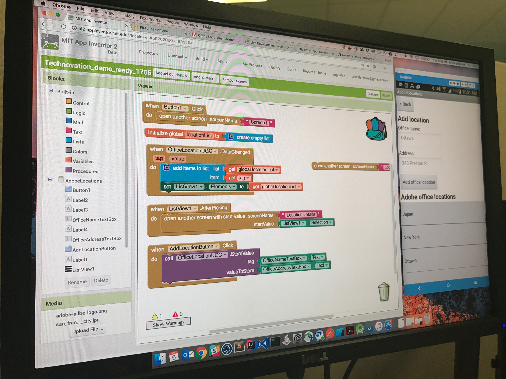
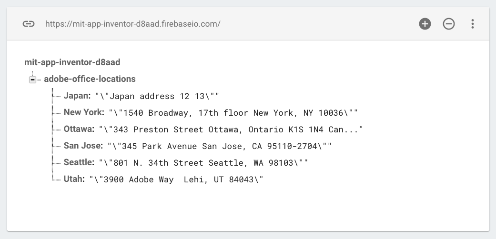

# Technovation: Adobe locations Firebase demo

Included in this repository is the app source for the demo shown at the Technovation event on April 5th, 2017 in Ottawa:

## Usage

1. Download (or clone) the [Technovation_Adobe_locations_firebase_demo.aia](Technovation_Adobe_locations_firebase_demo.aia) file to your computer
2. From the [MIT App Inventor 2](http://ai2.appinventor.mit.edu/) webapp, select the Projects menu, then "Import project (.aia) from my computer ..."
3. Choose the `Technovation_Adobe_locations_firebase_demo.aia` file from your computer
4. Click OK, and a copy of the original project will be created in your App Inventor workspace

## About the data

The Firebase data is now in a read-only state, so you will not be able to add new locations using the app. However, you can use your own Firebase project if you'd like to try out writing data to the server:

#### Create your Firebase project:

1. Navigate to [firebase.google.com](https://firebase.google.com)
2. Sign in with your Google credentials
3. Click the "Go to Console" link (which will take you [here](https://console.firebase.google.com/))
4. Click the "CREATE NEW PROJECT" button
5. Give your new project a name (such as `my-adobe-location-data`), and select your country from the Country/region dropdown, then click "CREATE PROJECT"

#### Configure anonymous read/write access:

Since this app does not support authentication, in order to write to the database we need to enable anonymous write access.

1. From your new project's Firebase console, open the Database item (listed in the left hand column of the page)
2. From the tabs which appear under the header "Realtime Database", select "RULES"
3. Replace both occurrences of `auth != null` with `true`
	- NOTE: this config is OK for a demo, but should not be used in a real/production scenario!!
4. Click the "PUBLISH" button which appears after making the above changes
4. The database can now be read and written to without any authentication

#### Wire the app up to your Firebase project

1. Back in the [MIT App Inventor 2](http://ai2.appinventor.mit.edu/) webapp, we need to make a change to the two Firebase components in use in the app
2. Open the "AdobeLocations" screen
3. Switch to "Designer" mode
4. In the "Non-visible components" section, select the Firebase component named "OfficeLocationUGC" (UGC = user generated content)
5. In the "Properties" panel which appears on the far right of the screen, set the FirebaseURL property to the URL of the Firebase project you just created
	- the URL can be located from the [Firebase console](https://console.firebase.google.com), select your project, Database menu option, DATA tab
	- it will be a URL in this form: `https://<your project id>.firebaseio.com/`
6. The FirebaseToken value at this point is not relevant, and can be cleared
7. Next, open the "LocationDetails" screen
8. Make sure you are still in "Designer" mode
9. In the "Non-visible components" section, select the Firebase component named "LocationDetailFetcher"
10. In the "Properties" panel which appears on the far right of the screen, set the FirebaseURL property to the URL of the Firebase project you just created (same URL you used above for the other Firebase component)
11. Switch back to the "AdobeLocations" screen

You should now be able to add a new location entry, and see it appear instantly in the app (as well as the Firebase console)!

